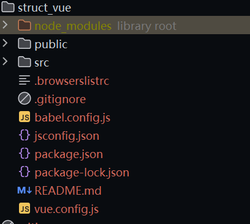

## vue 组件化开发思想
### vue 框架分支二
> * 注意我们的主分支中的vue 常用指令是 vue2 和 vue3 都需要使用的公共部分
> * mustache 语法，template模板 都是两大版本的共同可以使用的
> * 同时我们的 vue3 也是全面支持 vue2 中的语法使用的！！！
> * 组件化的开发就是实现的是我们的将一个复杂的问题拆分为一个一个小的问题进行解决的思想

### 组件化开发思想转变
> * 如果我们的一个程序的思维逻辑是很大的，但是这个时候我们需要进行的是
> * 在将全部的逻辑集合在一起解决，这个时候就会十分的复杂
> * 所以说这个时候就出现了我们的组件化的开发思想
>   * 将一个复杂的问题，拆分为一个一个小的问题，然后将小的问题一个一个的进行解决
>   * 最终达到我们的解决大问题的能力，这个就是我们的组件化开发思想
>   * 同时这样的开发也是很便利于我们后期的维护工作的，代码复用性更高，性能也随之优化了
>   * vue react angular 三大前端框架都是使用的是组件化开发模式(flutter也是组件化的)
> * 在我们实现完成一个页面的时候，我们可以实现的是将我们的页面中的每个部分抽象为
>   * 一个一个的小小的组件，每个组件里面有自己的功能逻辑代码体
>   * 同时我们还是可以将我们的组件进行一定程度上的复用，来提高我们的代码复用率
>     * 这个就可以实现的是我们的全局组件和局部组件的区分了
>     * 这个只是我们的思想性的开发模式，每个人的抽离不同，以及代码风格的差异，
>     * 所以说每个人的抽离方式就有所差异，就会有所不同


### 根组件
> * 我们在以前的代码书写中，如果说使用的是我们的 html 来实现的开发
> * 当时我们的书写的代码是通过 Vue.createApp({}).mount() 
>   * 来实现的创建的我们的组件，但是实际上话我们的 {}
>   * 也是一种组件的，该组件就是我们的根组件
>   * 所以说后面的 vue 的工程化开发中就会具有一个入口文件来实现我们的一些操作
>     * index.js / index.ts 来实现将我们的根组件导入
>     * 然后使用 createApp api 以及 mount 来实现挂载到我们的 index.html 中的指定容器
>     * 同时我们进行挂载的根组件就是 App.vue
>   * 根组件是其他组件的容器，组件的不断地细分，就形成了我们地组件树结构 component tree
```html
<!--这个就是我们地非工程化开发使用 vue 地开发模式的代码-->
<!--createApp 中的对象就是我们的根组件，后期使用组件化开发的话，就是我们的 App.vue-->
<!doctype html>
<html lang="en">
<head>
    <meta charset="UTF-8">
    <meta name="viewport"
          content="width=device-width, user-scalable=no, initial-scale=1.0, maximum-scale=1.0, minimum-scale=1.0">
    <meta http-equiv="X-UA-Compatible" content="ie=edge">
    <title>demo_count</title>
</head>
<body>
<div id="app">
    
</div>
<script src="../vue_local/vue_lib/vue.js"></script>
<script>
    Vue.createApp({
        template: ``,
        data() {},
        methods: {},
        computed: {},
        watch: {}
    }).mount("#app")
</script>
</body>
</html>
```

```html
<!--使用我们的工程化开发的思想来实现我们开发-->
<!doctype html>
<html lang="en">
<head>
    <meta charset="UTF-8">
    <meta name="viewport"
          content="width=device-width, user-scalable=no, initial-scale=1.0, maximum-scale=1.0, minimum-scale=1.0">
    <meta http-equiv="X-UA-Compatible" content="ie=edge">
    <title>demo</title>
</head>
<body>
<div id="app">

</div>
<script src="../vue_local/vue_lib/vue.js"></script>
<script>
    // 开始定义根组件（等价于脚手架中的 App.vue）
    const App = {
        template: `
        <div>{{ title }}</div>
        <div>{{ name }}</div>
        `,
        data() {
            return {
                // 数据来源于服务器
                title: "rootComponent",
                name: "juwenzhang"
            }
        },
        methods: {},
        computed: {},
        watch: {}
    }
    
    // 定义我们的第二个组件(子组件)
    const productItem = {
        
    }
    
    Vue.createApp(App).mount("#app")
</script>
</body>
</html>
```

### 注册组件
> * 通过上面的例子我们就可以知道的是，我们的组件就是一个一个的对象
> * 但是到了当前的步骤，我们的组件任然是无法进行使用的
> * 只有等到我们把组件进行注册后才可以使用我们自己开发的组件
> * 所以说接下来我们就开始注册我们的组件
>   * 注册组件也是含有两种组件的注册的
>     * 一种是注册我们的全局组件
>       * 全局组件就是实现的是在任何地方都是可以直接只用的组件
>     * 一种是注册我们的局部组件
>       * 局部组件就是只有在自己注册过的地方才可以正常的使用

#### 注册全局组件
> * 实现注册我们的全局组件就是通过的是我们的 createApp 
>   * 创建的根组件来实现的创建的我们的全局组件
>   * 其内部具有一个方法: **.component**
>   * 该方法就是用来实现的是注册我们的全局组件了
>   * Vue.createApp(App).component(name, productItem)
>     * 该方法具有的参数
>       * 第一个参数是我们组件的名称
>       * 第二个参数是我们组件的配置对象
>     * 使用组件: <name/> | <name></name>
```html
<div id="app"></div>

<template id="product_item">
    <div>标题</div>
    <div>名称</div>
</template>

<template id="nav">
    <h2>我是全局导航组件</h2>
</template>

<script>
    // 开始定义根组件（等价于脚手架中的 App.vue）
    const App = {
        template: `
            <product-item/>
            <nav/>
        `,
        data() {
            return {
                
            }
        },
        methods: {},
        computed: {}
    }
    const app = Vue.createApp(App)
    
    
    // 注册我们的全局组件
    app.component("product-item", {
        template: "#product_item",  // 组件的模板使用
        // 开始定义组件自己内部的逻辑
        data() {
            return {}
        },
        watch: {},
        computed: {},
        methods: {}
    })
    
    // 注册第二个全局组件
    app.component("nav", {
        template: "#nav",
        // 开始定义组件自己内部的逻辑
        data() {
            return {}
        },
        watch: {},
        computed: {},
        methods: {}
    })

    // 注册根组件以及挂载页面
    app.mount("#app")
</script>
```

#### 注册局部组件
> * 在开发中我们大部分都是在使用我们的局部组件
> * 但是全局组件有时间不一定使用
>   * 所以说我们的全局组件的定义的话，是含有很大的代码相同点的时候，
>   * 才使用我们的注册全局组件
> * 局部组件的注册方式
>   * 就是通过我们的选项式 api 中 components 属性来实现注册局部组件
>   * 使用原生的 html 中书写我们的局部组件，会有很多的不同的写法，我这里的示例只是其中一种
```html
<div id="app"></div>
<template id="product_item">
    <div>标题</div>
    <div>名称</div>
</template>
<script>
    // 开始创建我们的组件
    const ProductItem = {
        template: "#product_item",
        data() {
            return {}
        },
        methods: {},
        computed: {},
        watch: {}
    }
    
    // 开始定义根组件（等价于脚手架中的 App.vue）
    const App = {
        // 使用局部组件
        template: `
            <product-item />
        `,
        data() {
            return {
                
            }
        },
        methods: {},
        computed: {},
        // 开始实现注册局部组件
        components: {
            product-item: ProductItem
        }
    }
    
    const app = Vue.createApp(App)
    // 注册根组件以及挂载页面
    app.mount("#app")
</script>
```

### html转向vue
> * 我们的 vue 开发中，实际上的话，最大的特点是我们的工程化开发中的
> * 所以说我们的不是在一个 html 文件中进行书写的
>   * 所以说我们为了实现这样的抽离，我们的就可以实现的是使用我们的 vue 文件
>   * 同时我们需要注意的是: 组件化开发模式中，本质上的话，每个组件都是一个对象
>   * 最终的使用也是作为对象来使用的
> * 就是为了让大家认识组件实际上是一个对象的特点
>   * 所以说我们才花费大量的篇幅来使用 html 文件编写我们的 vue 代码
>   * 同时这也是为什么我们的 vue 文件可以支持导入导出的原因之一了
>   * 原本的 html 页面的话，是不支持导入导出的，因为 html 只是一个超文本编辑语言
>   * 不是真真的编程语言，所以说不支持导入导出
>   * 这里同时也涉及到了一个概念: 
>     * 原生的 html 是不可以完成我们的 SPA （Single Page Application）页面的开发的
>     * 但是使用 vue | react | angular 就可以
>     * 这一点也是因为上面的原因存在所致的(我个人的理解是这样的)
> * 然后在我们的开发中，工程化开发
>   * 就可以使用不同的打包工具来实现对 vue 文件的解析
>   * 实现打包
>   * 打包工具的话: 
>     * vue2 cli 使用的打包工具是我们的 webpack
>     * vue3 cli 使用的打包工具是我们的 vite
>     * vue-loader 来进行解析


### vue工程化开发模式
> * 实现我们的 vue 框架的工程化开发的模式共有两种
>   * 一种是使用官方提供的脚手架 vue cli
>     * 帮助我们搭建项目架构的工具就是我们的脚手架
>     * cli —— command line interface 
>     * **vue 搭建脚手架 —— 基于打包工具 webpack 的脚手架**
>       * 首先全局安装脚手架 `npm install -g @vue/cli`
>         * 查看脚手架版本: `vue --version`
>       * 然后就是使用我们的脚手架来实现创建项目 `vue create my-vue2-project`
>     * **vue3 搭建项目 —— 基于 vite 的脚手架**
>       * `npm create vite@latest my-vue3-vite-project`
>   * 一种是自己通过 vite | webpack | rollup 打包工具自己搭建脚手架


### 创建项目脚手架分析
#### 通过 vue/cli 创建的项目结构剖析
> 
> * **node_modules**  就是表示的是我们的安装的依赖包所存储的目录
> * **public** 里面具备我们的进行打包的时候使用的 html 模板，以及图标
> * **src** 目录就是实现的是我们的编写源码存在的目录
> * **.gitignore**  就是我们上传代码的时候需要忽略的文件以及目录配置
> * **babel.config.js** 就是对我们的babel 转义工具的配置
> * **jsconfig.json** 准确来说就是给我们的编译器来使用的，从而基于我们更好的代码提示
> * **.browserslistc** 浏览器适配文件
> * **package.json** 项目的配置文件，包管理文件
> * **package-lock.json** 依赖版本管理锁定文件
> * **README.md** 就是项目的描述文档
> * **vue.config.js** 就是实现的是我们的webpack的配置，类似于我们的 webpack.config.js