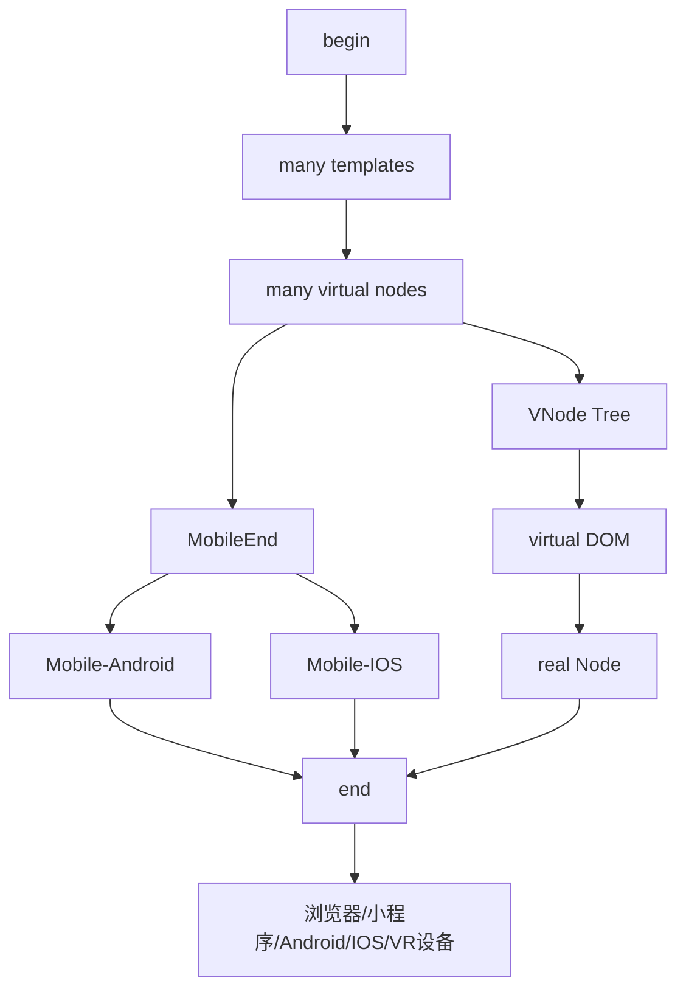

# 前端框架之 Vue
> **[Vue 官网](https://cn.vuejs.org/)**
> 
> * 两种设计模型
>   * MVC 模型: Model-View-Controller —— 安卓开发 和 IOS开发
>   * MVVM 模型: Model-View-View-Model 
>     * M 就是我们的模型设计
>     * V 就是我们的视图模型设计 —— html | CSS
>     * C 就是我们的控制模型设计 —— JavaScript

## 使用 vue 进行开发引入方式总结
> * 通过 CDN 的方式进行引入，即是说在我们的原生 HTMl 中直接通过 script 标签 CDN 引入即可
>   * **`<script src="https://unpkg.com/vue@3/dist/vue.global.js"></script>`**
>   * 但是现在的引入使用模式还是有一定的不足的
>   * 因为我们的 vue 源代码还是在我们的 CDN 服务器中，这样会通过发送网络请求的形式使用 Vue
> * 导入使用方式二
>   * 通过下载我们的 vue 源码在本地，然后实现后续的直接引入本地源码文件即可
>   * 这样就可以实现减少对 vue 源码发送的一个 http 请求了
***
***

## Vue Options API 
### data option
> data 本身是一个函数，其作用是用来定义我们具体数据的
> 内部含有一个 return 语句，返回的是对象，内部就可以通过定义一个一个的数据
> 然后通过 插值语法即可实现我们的动态绑定数据了
> * 在 vue 的选项式 开发中，我们实现数据的双向绑定使用的是 **属性描述符实现的**
> * 在 vue 的组合式 开发中，实现数据的双向绑定，**底层使用的是 proxy 和 reflect 实现的**
 ```javascript
// 在原生 html 文档种的体现
Vue.createApp({
    template: `书写模板`,
    data() {
        return {
            // 定义数据
        }
    }
})

// 在工程化开发中的体验
export default {
    data() {  // data: function() {
        return {
            // 定义数据
        }
    }
}
```

### methods option
> * 该选项是一个对象，内部书写的是一些我们的方法
> * 同时在内部的话是可以通过 this 来实现获取我们的 data 中定义的数据
> * 但是在我们的 vue3 组合式开发模式中，对使用 this 就十分的抵触了，**只是 vue2 中建议使用 this**
> * 同时因为这个 this 来获取我们数据的特点，所以说官网**不推荐使用我们的箭头函数来书写我们的方法**
>   * 因为 箭头函数中 this 的指向和执行上下文相关
>   * 如果说通过使用箭头函数内部使用了 this 的话
>   * 最终的效果就是 this 不会指向我们期望指向的组件
>   * 从而导致 data 中具有的属性 a, 通过 this.a ，这样的访问就是我们的 **undefined**
```javascript
methods: {
    increment: function() {},
    decrement: function() {},
    method01: function() {},
    method02: function() {} 
}
```

### Mustache 插值语法
> * 插值语法就是实现的是我们的通过 {{}} 获取我们的data 中的响应式数据
> * 通过改语法就可以简单的获取得到我们的动态数据了，从而实现动态的渲染到我们的页面中了
> * 同时我们的微信小程序原生开发中也是具备我们的该语法的
> * vue 开发模式中是可以支持我们的vue 中的模板语法以及 jsx 的模板语法
> * 在我们的 react 开发中，使用的是 jsx 的模板语法
> * **插值语法中可以是: 自定义的数据或者说JavaScript 表达式**
> * `<h2> {{ data }} </h2>`
> * `<h2> {{ data * 2 }} </h2>`

### template 模板
> 类似于我们小程序开发中的 block 元素
> 在实际的渲染中我们的 template 是会被直接忽略的
> 通常和我们的 v-if v-else 连用
> 是一个不可见的包裹元素

### vue 中常用的指令
> * 指令的使用地方是在我们的标签属性中进行书写的，就是一个属性罢了

#### v-text 指令
> * 该指令用来实现的是我们的更新元素中 textContent 的
> * `<h2 v-text="message"></h2>`
> * 这个时候我们元素的内容就是绑定的是我们的message对应的具体的值了

#### v-html 指令
> * 就是如果我们的元素中原本是展示的是我们的 html 内容，这个时候我们的 vue 本身是不会对其进行解析的
> * 所以说这个时候就可以通过 v-html 来实现解析我们的内容为 html 的数据
> * 这样可以实现的是将我们的原本的 html 解析后的内容进行显示
> * 下面的例子就是渲染的 `hello JuWenZhang!`
```javascript
export default {
    data() {
        return {
            content: `<h2 style="color: red"> hello JuWenZhang! </h2>`
        }
    }
}
```
```vue
<template>
  <h2 v-html>{{ content }}</h2>
</template>
```

#### v-once 指令(优化指令)
> 该指令就是实现的是我们的对应的东西只是渲染一次,即使是进行修改了，还是原本的值
> 默认的 渲染模式是一旦内部的数据进行了修改，后续任然还是会重新渲染的
> 通过使用我们的 v-once 从一定的程度上是可以优化我们的代码的
> `<h2 v-once>{{ count }}</h2>`

#### v-pre 指令(优化指令)
> 实现的是我们的跳过原始的内容解析过程，直接把 Mustache 语法同时进行渲染
> 就是显示原始的内容
> 该指令直接跳过了我们的解析过程
```vue
<template>
  <h2 v-pre>{{ message }}</h2>
</template>
```

#### v-cloak 指令(优化指令)
> * 就是在我们的实际开发中，我们的一切数据来源是请求我们的服务器的
> * 但是请求是需要一定的时间的，所以说我们就需要在我们将数据请求回来之前，把原本的内容进行隐藏
> * 这个时候就可以使用我们的 v-cloak 指令了，该指令需要和我们的 CSS 共同完成
> * 只有等待数据从服务器中请求回来后才将内容实现渲染出来
```vue
<template>
  <h2 v-cloak>{{ message }}</h2>
</template>

<script lang="js">
  export default {
      data() {
          return {
              message: "from server data"
          }
      }
  }
</script>

<style lang="css">
  [v-cloak] {
    display: none;
  }
</style>
```

#### v-memo 指令(优化指令)
> 实现的是用来判断我们的该组件渲染是否和上一次相同，相同的话直接跳过本次解析
> 内部传递的是一个数组
> 下面的代码就是只有当我们的 height,age 进行了修改才会重新渲染页面
```vue
<template>
  <div v-memo="[height, age]">
    <h2>{{ name }}</h2>
    <h2>{{ age }}</h2>
    <h2>{{ height }}</h2>
  </div>
  <button @click="updateName">修改姓名</button>
</template>

<script lang="js">
  export default {
      data() {
          return {
            name: "JuWenZhang",
            age: 18,
            height: 170
          }
      },
        
      methods: {
          updateName: function () {
              this.name = "76433"
          }
      }  
  }
</script>
```

#### v-bind 指令(重要常用指令【必看】{属性绑定})
> * 该指令是用来进行绑定我们的属性的一个指令
> * 前面我们的插值语法只是单纯的实现的是我们的绑定内容的模板语法
> * 但是为了给我们的元素绑定动态属性，这个时候就需要使用我们的 v-bind 指令了
> * 可以使用我们的 **:** 进行简化其写法，但是对于初学者的话，还是写全为好
> * 内部是可以绑定**属性数据的**，还可以绑定我们的**一个表达式的（经典的三元运算符）**或者**对象语法**
> * 使用场景
>   * 绑定元素中的默认的属性 src, href
>   * 控制 class 属性 对象或者数组绑定
>   * 控制 style 属性 后面跟的是一个对象
>   * 动态绑定自定义属性 `:[属性名] = "属性值"`
```vue
<template>
  <!-- 绑定基本属性 -->
  
  <a :href="a_url">百度</a>
  <button @click="changeImgUrl">切换图片</button>
  
  <!-- isActive 为 true 那就直接添加active属性: 绑定一个对象,通过boolean 值来间接性的决定属性是否存在 -->
  <button :class="{active: isActive, isNone: true}" @click="changeStatus">点击切换按钮样式</button>
  
  <!-- 绑定函数 -->
  <button :class="getDynamicClasses()"></button>
  
  <!-- 绑定我们的数组 -->
  <button :class="[className, getDynamicClasses(), {active: isActive, isNone: true}]"></button>
  
  <!--控制绑定我们的 style-->
  <!-- 驼峰绑定或者异引号绑定 -->
  <div :style="{ backgroundColor: backgroundColor, width: `${width}px` }"></div>
  
  <h2 :style="h2Style"></h2>
  
  <div :[value]="'data-value'"></div>
  
  <!-- 绑定对象 -->
  <div v-bind="bindObj"></div>
</template>

<script lang="js">
  export default {
      data() {
        return {
          // 下面的数据来自于我们的服务器
          img_url: "https://www.baidu.com/img.png",
          message: "图片请求加载失败...",
          a_url: "https://www.baidu.com",
          isActive: true,
          isDisplay: true,
          className: "active",
          backgroundColor: "red",
          width: 200,
          h2Style: {
              fontSize: "20px",
              color: "orange"
          },
          value: "data-value",
          bindObj: {
              name: "juwenzhang",
              age: 18
          }
        }
      },
    
      methods: {
          changeImgUrl: function () {
              this.img_url = this.img_url === "https://www.baidu.com/img01.png" ?
                  "https://www.baidu.com/img.png" :
                  "https://www.baidu.com/img01.png"
          },

          changeStatus: function () {
              this.isActive = !this.isActive
          },
        
          getDynamicClasses: function () {
              return {active: this.isActive, isNone: this.isDisplay}
          },
      }
  }
</script>

<style lang="css">
  .active {
    color: red;
  }
</style>
```

#### v-on 指令(重要常用指令【必看】{事件绑定})
> * v-on 指令是用来实现的是我们的动态的绑定事件的
> * 因为我们的网页中难免含有很多的和用户之间进行交互的事件存在
> * 所以说我们就需要使用该指令来实现动态的添加某事件
> * 代码书写格式
>   * 完整书写: `v-on:事件名称=”回调函数“`
>   * 简写形式: `@事件名=”回调函数“`
> * 事件绑定的默认参数
>   * 在绑定我们事件的时候，会默认的传递一个 event 对象进来，和原生相同
>   * 如果明确的传递了我们的参数，那就直接传递给我们的回调事件处理函数，这个时候 event 就会丢失
>   * 如果在回调函数具有参数的时候任然想要传递 event 对象，这个时候我们可以传入 **$event**
> * 绑定事件修饰符(就是对我们当前的事件做一些特殊的处理)
>   * .stop 阻止事件冒泡产生 event.stopPropagation() 底层实现
>   * .prevent 阻止默认行为产生 event.preventDefault()
>   * .capture 转换行为模式，让事件冒泡转换为事件捕获
```vue
<template>
  <div :style="divStyle" v-on:click.stop="changeBoxStyle"></div>
  
  <!-- 实现绑定多个事件: 通过对象来实现 -->
  <div v-on="{ click:changeBoxStyle, mouseover: boxMouseOver('76433', 18, $event) }"></div>
</template>

<script lang="js">
  export default {
      data() {
          return {
              divStyle: {
                  backgroundColor: "orange",
                  width: "200px",
                  height: "200px"
              }
          }
      },
      
      methods: {
          changeBoxStyle: function (event) {
              this.divStyle.backgroundColor = this.divStyle.backgroundColor === "blue" ?
                  "red" : "blue"
              console.log(event)
          },
          
          boxMouseOver: function (name, age, event) {
              event.stopPropagation()
              console.log("~~~", name, age, event)
          }
      }
  }
</script>

<style lang="css">
  
</style>
```

#### v-if | v-show 指令(重要指令【必看】{判断指令})
> * v-if...v-else-if...v-else
>   * 就是实现的是满足特定的条件进行渲染特定的内容
>   * 该方式实现的渲染和不渲染实现的是我们的销毁组件来实现的
>   * 支持使用 template
> * v-show
>   * 就是通过我们的 boolean 值
>   * 来实现我们的控制 display 来进行是否渲染组件的
>     * none 隐藏
>     * block 显示
>   * 不支持使用 template
>   * 元素在显示和隐藏之间实现来回的转换的话，就选择这个
>     * 因为其元素本身还是存在的，只需要进行重绘操作即可，不用回流
```vue
<template>
  
  <div>
    <div v-if="names.length > 0">
      <div v-for="(name, index) in names" key="index">
        <span>{{ name }}</span>
      </div>
    </div>
    
    <div v-else>
      <h1>服务器正在返回数据，请等待~~~</h1>
    </div>
  </div>
  
  <div>
    <div v-if="Object.keys(info).length > 0">
      <span>{{ info.name }}-{{ info.age }}</span>
    </div>
    <div v-else>
      <h2>服务器正在响应，请等待~~~</h2>
    </div>
  </div>
  
</template>

<script lang="js">
  export default {
      data() {
          return {
              names: ["JuWenZhang", "76433", "433", "水逆信封"],
              info: {
                  name: "76433",
                  age: 18
              }
          }
      }
  }
</script>

<style>
  
</style>
```

#### v-for 指令(重要指令【必看】{列表|对象渲染})
##### 列表渲染
> * 我们在实际开发中，我们服务器给我们返回的数据是我们的列表
> * 所以说我们的列表渲染至关重要，就是我们的 for 循环
> * 基本格式 `v-for="(item, index) in arr" key=index"`
> * 实现遍历数组的时候，首先实现的是获取我们的元素本身，然后是我们的元素下标缩影
##### 对象遍历
> * 实现遍历我们的对象的时候，首先获取的是元素本身，然后是元素的键，最后才是元素的索引值
> * `v-for="(value, key, index) in objs" key="key"`
> 只要是我们的可迭代对象就可以实现我们的遍历，同时也是可以遍历数字的
##### 数组更新检测
> * 该方法就是实现的是监听我们的数组是否发生了变化
> * 如果发生了变化，那么最终的实现效果就是我们的页面也会重新渲染
> * 监听我们的数组的变化的
> * vue 中可以实现监听的数组的方法含有，下面的方法都是对原数组本身进行了修改
>   * push() 尾插法
>   * pop()
>   * shift()
>   * unshift() 首插法
>   * splice()
>   * sort() 排序
>   * reverse() 逆转
> * 所以说究其本质为什么回对其进行监听
>   * 是因为我们的原数组被修改了，所以说我们就可以通过修改我们的原数组实现我们的
>   * 页面的刷新的操作，本质就是对原数组进行了修改即可引发我们的**数组更新检测**
##### VNode
> * VNode 就是我们的 Virtual Node 虚拟节点
> * 在我们的 vue 的开发模式中，无论是组件还是元素，都是一个一个的 VNode
> * VNode 就是一个 javascript 对象
>   * 我们的 vue 底层的代码帮助我们做的是
>   * 把我们书写的每一个元素或者组件通过中间的 VNode 对象实现转换为了一个一个的真实节点DOM
>   * 然后就可以实现真真的在页面中进行渲染每一个节点或者说元素
> * 同时我们的多个 VNode 可以实现我们的组成 VNode Tree
> * 虚拟 DOM 存在的最大的意义是： **实现我们的跨平台开发**


```vue
<template>
  <!-- 开始我们的列表渲染 -->
  <template v-if="arrName.length > 0">
    <div v-for="(item, index) in arrName" key="index">{{ item }}</div>
  </template>
  
  <template v-if="arrObj.length">
    <div v-for="(item, index) in arrObj" key="index">
      {{ item.name }}-{{ item.age }}
    </div>
  </template>
  
  <template v-if="Object.keys(objs).length">
    <div v-for="(value, key, index) in objs" key="key">
      {{ value }} - {{ key }} - {{ index }}
    </div>
  </template>
</template>

<script lang="js">
  export default {
      data() {
          return {
              arrName: ["76433", "433", "水逆信封"],
              arrObj: [
                { name: "76433", age: 18 },
                { name: "433", age: 19 }  
              ],
              objs: {
                  name: "76433",
                  age: 18,
                  height: 170,
                  weight: 55
              }
          }
      }
  }
</script>
```