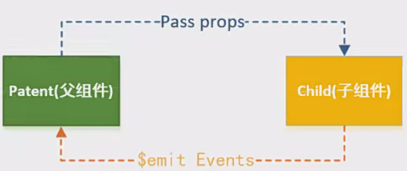

## vue 组件通信总结
> * 组件通信就是实现的是我们的实现组件之间相互传递数据的方法

### 组件之间的关系
> * 在前面的科普中，我们知道，当前的开发模式中，我们是使用的是我们的
> * 组件化的开发模式，组件化的开发模式在 vue react angular 中都是具有体现的
> * 这个时候组件之间进行数据传递就是一个我们需要注意的一点
> * 但是在这个之前，我们先来了解一下组件之间具备的关系有那些:
>   * **父子组件关系**
>   * **同级组件关系**
>   * **随意组件关系**
>   * **跨级组件关系**

### 父子组件通信
#### 父组件向子组件传递数据
> * 父组件向子组件传递数据的前提是我们的在父组件中已经注册了子组件的
> * 使用的是我们的在子组件中使用 props option 来实现接收父组件传递的数据
> * 父组件通过我们的子组件传递数据的方式通过添加属性来实现的
> * **props 含有两种写法:**
>   * 一种是我们的数组写法: 直接接收即可
>     * 数组写法的缺点就是我们无法使用类型验证
>     * 同时书写不了默认值
>   * 另外一种就是我们的对象写法
>     * 使用我们的对象的写法的话
>     * 可以实现的是我们的指定类型 **type**
>     * 实现指定默认值 **default**
>     * 实现指定在父子传递数据的时候是否必须 **required**
> * **不同类型数据的默认值书写**
>   * Number | String
>     * 直接书写对象的类型即可
>   * Object
>     * 书写函数，将对应的对象返回，或者说 null
>   * 父组件向子组件传递参数的时候，如果传递的数据是 Number
>   * 需要在属性前进行属性绑定: 就是需要在属性前进行添加 `:` 
> * **同时我们实现传递数据的时候**
>   * 可能会有的就是在 子组件中不用 props 进行接收
>     * 该属性就是我们的: 非 prop 的属性
>   * 常见的属性含有: class style id 属性等
>     * 这些属性会被添加到我们的子组件的根组件中去
>   * 同时我们也是具备方法来禁用他的
>     * 就是使用我们的 `inheritAttrs options`
>   * 对于这些非 props 属性是可以通过 `$attrs` 来实现获取的

#### 子组件向父组件传递数据
> * 通过的是我们的 **$emit** 来实现的发送触发事件
>   * 从而实现传递数据
>   * 就是自定义事件罢了，没有什么的
> * **实现子传父的操作是:**
>   * 前提是两个组件之间绑定起来了的
>   * 子组件中首先定义好后面可能会发生的事件
>   * 父组件通过 v-on 的方式传入监听的自定义事件，同时触发的事件定义
>   * 最后根据事件名称在子组件中来触发对应的事件
> * **自定义事件**
>   * 我们通过在子组件中自定义了事件后
>   * 为了想让父组件中可以接收到
>   * 这个时候我们是可以通过 emits options 来将我们自定义事件
>   * 全部写在该 options 中，让父组件中可以接收我们的自定义事件
>   * 写法具备两种
>     * 一种是我们的数组写法
>       * 该写法是没有任何的参数验证的
>     * 一种是我们的对象写法

### 插槽slot —— 父子组件通信
#### 认识插槽 slot
> * 插槽就是实现的是我们的将代码进行抽离共性，预留不同
> * 共同元素以及内容依然在组件内进行封装
> * 不同的元素使用我们的 slot 进行占位，让外部来决定我们具体显示什么元素
> * 插槽的使用使用的是我们的组件双标签化进行书写
#### 插槽 slot 的使用
> * 插槽就是用来实现的是我们的占位使用的
> * 使用的是我们的 slot 来进行占位
> * 同时在其他地方使用我们的插槽组件的话，也是可以像内部传递元素的
> * 来替代原本在 slot 内部书写的默认值
#### 具名插槽 slot 的使用
> * 具名插槽就是为了实现我们的在一个组件中含有多个插槽的时候
> * 用来实现区分我们的插槽
> * 通过属性 name 来实现区分我们的插槽 slot
> * 在使用自定义的组件的时候，就是使用的是我们的 template 中的 v-slot:slot-name 
>   * 来实现我们的区分元素插入固定的位置的
> * 动态插槽名: v-slot:[变量]
> * v-slot 的缩写为 #
#### 作用域插槽 slot 的使用
> * 为什么会出现我们的作用域插槽
>   * 这个问题就是会设计到我们的作用域渲染原理有关
>     * 因为我们的组件中的某个变量数据只可能在本组件中进行使用
>   * 但是我们为了完成整个组件之间的数据互通链来说的话
>     * 这个时候我们通过父组件向子组件中传递了数据
>     * 子组件中接收数据，直接进行显示
>       * 但是此时数据链直接在子组件中终止了
>     * 为了数据链的完善，子组件又向父组件使用插槽传递数据
>       * 父组件再根据子组件传递的数据实现展示
>   * 最后就实现了我们的数据链的完善，只要数据一修改，最终的页面的效果就随之修改
> * 完成上面的步骤，就实现了我们的数据驱动视图的效果了

### Provide和Inject —— 非父子组件通信
> * 这个的做法就是我们的依赖注入的形式实现最终的组件之间的数据传递
>   * 父组件中提供一个 provide 来实现提供数据，
>   * 子组件中使用一个 inject 来实现接收这些数据
> * 这样之后，我们的组件之间就可以不用考虑传递的数据来自于那个组件了
> * 但是这样的话还是需要进行的是我们的每个组件之间是是具备联系的

### 其他组件通信方式
> * 后面的话，我们实现组件之间的通信我们就是使用的是我们的状态管理库来实现的了

### 事件总线
> * 同时还可以使用我们的时间总线来实现我们的组件信息传递

