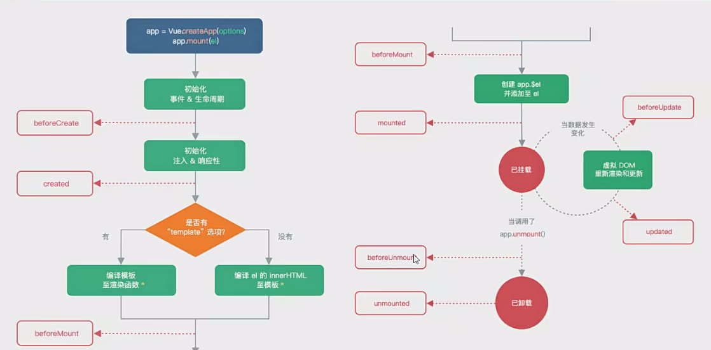
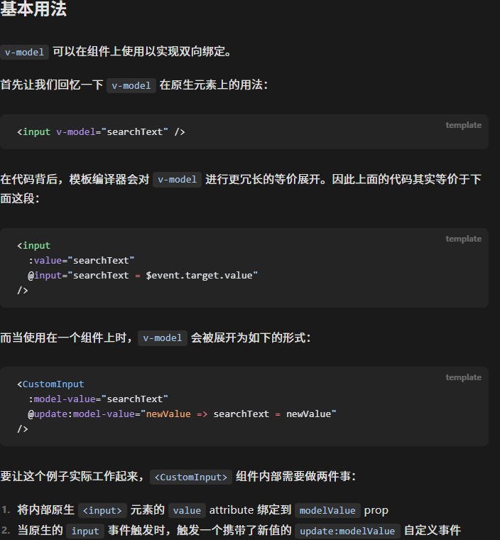

### 认识声明周期
> * 声明周期就是实现的是我们的一个组件在开始到结束所表现出来的行为以及状态的设置
>   * 每个组件都是含有四个周期的: **创建、挂载、更新、卸载**
>   * 在不同的生命周期中，我们需要对我们的组件设置独有的一些代码逻等
>   * 同时 vue2 和 vue3 的声明周期是十分相似的，但是还是有一定的区别所在的
> * 生命周期的实现依赖于我们的生命周期函数
>   * 生命周期函数就是一些钩子函数（回调函数），也就是我们的组件在某个生命周期会触发的代码逻辑
>   * 通过声明周期我们就可以知道什么时候我们组件触发什么样子的逻辑
>   * 生命周期函数就是我们代码对应的事件阶段执行的代码体了
>   * 在 vue2 中生命周期函数还是使用的是我们的选项式的格式进行书写的
>   * 生命周期函数是自动运行的呐
> * 生命周期函数的流程
>   * 
>   * 生命周期函数具有
>     * 创建前
>       * **beforeCreate**
>     * 创建后
>       * **created**
>         * 发送我们的网络请求
>         * 获取数据
>     * 挂载前
>       * **beforeMount**
>     * 挂载后
>       * **mounted**
>         * 实现操作我们的 DOM 的操作
>     * 更新前
>       * **beforeUpdate**
>     * 更新后
>       * **updated**
>     * 卸载前
>       * **beforeUnmount**
>     * 卸载后
>       * **unmounted**
>   * 重要的声明周期是我们的 **created** 已经 **mounted** 的操作


### $refs 获取元素或者组件实例
> * 在我们的某些情况下，我们想要实现获取得到我们的某个元素或者子组件的实例
>   * 在 vue 中就不推荐我们去操作原生的 DOM 了
>   * 这个时候就出现了给元素或者组件绑定一个 **ref="refName""** 属性来实现后续的操作元素
> * 然后通过我们的 `this.$refs.refName` 来进行修改我们的内容的
>   * 通过这样的方法我们实现获取得到的我们的就是元素本身
>     * 通过这样的处理后我们就可以实现后续的操作我们的元素本身了
>     * 获取元素的宽度，高度，样式等等的操作
>   * 这个就是我们的从命令式的编程事项转换为我们的生命式的写法了
> * ref 可以添加的地方是
>   * 我们的元素上面，获取到的就是我们的元素本身
>   * 一个是我们的组件上面的，组件上面的话获取到的是我们的 proxy 对象
>     * 同时在我们的组件上进行使用的话，我们就可以获取得到组件中的方法的，从而实现调用
>     * 同时我们还可以通过后续的 `.$el` 获取得到组件的根元素
>     * `this.$refs.GetEleByRef.$el`
>     * 这里就有一个很好的编码习惯了，推荐我们的组件里面尽量只有一个根元素
>       * 不要有多个根，后面的不好维护的
> * 和我们的 this.$refs 相同的两个属性还有
>   * this.$parent 获取的是当前组件的父组件 以及 this.$root 获取的是当前组件的根组件
```vue
<template>
  <div class="getRef">
    <h2 ref="title">hello world</h2>
    <button @click="changeTitle">修改我们的title</button>
  </div>
</template>

<script>
  export default {
    name: "GetEleByRef",
    methods: {
      changeTitle() {
        console.log(this.$refs.title)
        this.$refs.title.innerHTML = this.$refs.title.innerHTML === "hello vue" ? 
            "hello world" : "hello vue"
      }
    }
  }
</script>
```

### 动态组件的使用
> * 动态组件和我们的使用 v-if 来进行判断是一样的效果
> * 使用的是我们的 component 内置的组件以及内部的 is 判断来实现是否进行显示
```vue
<template>
  <div class="Dynamics">
    <div class="Dynamics-group">
      <div v-for="(tab, index) in tabs" key="index"
           class="Dynamics-item">
        <button
            :class="{active: index === currentIndex}"
            @click="changeIndex(index)">
          {{ tab }}
        </button>
      </div>
    </div>

    <!-- 通过逻辑判断来实现我们的决定什么显示什么不显示 -->
    <div class="context">
      <template v-if="currentIndex === 0">
        <Home></Home>
      </template>
      <template v-if="currentIndex === 1">
        <about></about>
      </template>
      <template v-if="currentIndex === 2">
        <category></category>
      </template>
    </div>

    <!-- 开始实现我们的动态组件来实现判断显示什么组件 -->
    <div class="context">
      <component :is="tabs[currentIndex]"></component>
    </div>
  </div>
</template>

<script>
  import Home from "./Home.vue";
  import about from "./About.vue";
  import category from "./Category.vue";
  export default {
    name: 'Dynamics',
    components: {
      Home,
      about,
      category
    },
    data() {
      return {
        tabs: ["home", "about", "category"],
        currentIndex: 0,
      }
    },
    methods: {
      changeIndex(index) {
        this.currentIndex = index
      }
    }
  }
</script>

<style scoped>
  .Dynamics-group {
    width: 200px;
    border-top: 2px solid red;
    margin-top: 10px;
    display: flex;

    .Dynamics-item {
      flex: 1;
    }
    .active {
      background-color: deepskyblue;
    }
  }
</style>
```

### keep-alive
> * 该属性就是为了实现的是让我们的组件保持一个存活的状态
>   * 如果不保持组件的存活状态，就可能导致我们的组件被销毁
>   * 这样的话，在组件中循环的被切换的时候就是一个十分吃性能的一个点
>   * 所以说对于我们的组件中的来回切换的操作，我们尽量就保证其是激活的状态
>   * 来减少性能的消耗
> * `<keep-alive>需要保持活度的组件</keep-alive>`
>   * 同时我们也是可以实现的是将我们指定的组件进行缓存的
>   * 内部进行添加属性 include 属性来包裹我们需要被缓存的组件即可
>   * include | exclude | max
>     * string | RegExp | Array —— include | exclude
>     * number | string —— max
> * include 里面的名称来自于我们的在子组件中定义的时候对组件的命名
> * is 中实现定义的组件，来自于我们的导入的时候的组件命名
>   * 对于我们的 keep-alive 还具备两个生命周期
>     * activated
>     * deactivated
```vue
<template>
  <div class="Dynamics">
    <div class="Dynamics-group">
      <div v-for="(tab, index) in tabs" key="index"
           class="Dynamics-item">
        <button
            :class="{active: index === currentIndex}"
            @click="changeIndex(index)">
          {{ tab }}
        </button>
      </div>
    </div>

    <!-- 通过逻辑判断来实现我们的决定什么显示什么不显示 -->
    <div class="context">
      <template v-if="currentIndex === 0">
        <keep-alive>
          <Home></Home>
        </keep-alive>
      </template>

      <template v-if="currentIndex === 1">
        <keep-alive>
          <about></about>
        </keep-alive>
      </template>

      <template v-if="currentIndex === 2">
        <keep-alive>
          <category></category>
        </keep-alive>
      </template>
    </div>

    <!-- 开始实现我们的动态组件来实现判断显示什么组件 -->
    <div class="context">
      <!-- include 里面的名称来自于我们的在子组件中定义的时候对组件的命名 -->
      <!-- is 中实现定义的组件，来自于我们的导入的时候的组件命名 -->
      <keep-alive include="Home,about">
        <component :is="tabs[currentIndex]"></component>
      </keep-alive>
    </div>

  </div>
</template>

<script>
  import Home from "./views/Home.vue";
  import about from "./views/About.vue";
  import category from "./views/Category.vue";
  export default {
    name: 'Dynamics',
    components: {
      Home,
      category,
      about,
    },
    data() {
      return {
        tabs: ["home", "about", "category"],
        currentIndex: 0,
      }
    },
    methods: {
      changeIndex(index) {
        this.currentIndex = index
      }
    }
  }
</script>

<style scoped>
  .Dynamics-group {
    width: 200px;
    border-top: 2px solid red;
    margin-top: 10px;
    display: flex;

    .Dynamics-item {
      flex: 1;
    }
    .active {
      background-color: deepskyblue;
    }
  }
</style>
```

### 异步组件
> * 我们就可以使用 import 函数来实现相应的操作
> * import 函数是一个异步的操作呐
> * 这样之后就会实现我们的异步打包的操作了
> * 同时我们的异步组件还含有我们的对象的写法
> * 书写异步组件的原因是我们的在进行打包的时候就可以实现我们的不同的打包效果
```javascript
import {defineAsyncComponent} from "vue"  // 导入我们的异步组件函数
const HomeAsync = defineAsyncComponent(() => import("./home.vue"))  // 定义异步组件
```


### 组件中使用 v-model
> * 在我们以前的话我们的 v-model 的使用的场景是在我们的表单元素中的
>   * 但是实际上的话数据的双向绑定还是可以在我们的组件中进行使用的
>   * 在我们的普通元素身上书写的 v-model 的
>     * v-model 实现使用的我们的原理是: v-bind + v-on:input 来实现的
>   * 在我们的组件元素上书写 v-model 的时候，也是内部帮助我们书写了两件事情的
>     * :model-value 以及 @update
> * [v-model 官网](https://cn.vuejs.org/guide/components/v-model.html)


